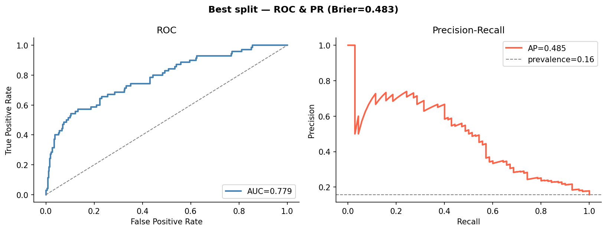

# PerLeadCNN — Preeclampsia Risk Estimation from 12-Lead ECG

A self-contained, reproducible release of **PerLeadCNN** (referred to as
"RepNet-SE" in our poster), a compact convolutional network that estimates
preeclampsia risk from a standard 12-lead ECG. This folder contains the final
model, the trained checkpoints, the exact code to **reproduce** the reported
metrics, and the code to **analyze** and **retrain** the model.



## Results (30-split patient-grouped cross-validation)

| Metric | Value |
|---|---|
| Parameters | **29,490** |
| AUROC | **0.7085 ± 0.0493** |
| AUPRC | **0.3423 ± 0.0751** |
| Youden's J | sens 0.730, spec 0.627, F1 0.404 |
| Screening (sens ≥ 80%) | sens 0.807, spec 0.496, **NPV 0.927** |
| Best split | AUROC **0.7793** (split 17) |
| Median split | AUROC 0.7251 (split 24) |

Cohort: 2,178 twelve-lead ECGs (335 preeclampsia, 15.4%) from 1,383 patients.
Numbers come from `results/multisplit_dbb6f49/` and are re-derivable from the
bundled checkpoints (see below).

## Model

3-stage, **weight-shared** 1D CNN applied independently to each lead; per-lead
features are pooled, concatenated across the 12 leads, and classified by a
single linear layer.

```
Input (B, 12, 2500)  ->  reshape (B*12, 1, 2500)
Conv1d(1->16, k31, s2) + BN + Mish
Conv1d(16->32, k21, s2) + BN + Mish      # shared across all 12 leads
Conv1d(32->48, k11, s2) + BN + Mish
AdaptiveAvgPool1d(1)  ->  reshape (B, 576)   # fuse leads (12 x 48)
Dropout(0.15) -> Linear(576, 2)
```

Defined in `src/model.py` (29,490 parameters).

## Quick start

```bash
pip install -r requirements.txt
export REPNET_DATA_DIR=/path/to/data   # see DATA.md (PHI, not included)
```

### 1. Reproduce the reported metrics (exact)
Re-evaluates the bundled checkpoints on their exact test splits and checks them
against the recorded numbers:

```bash
python -m src.evaluate          # prints a reproduced-vs-recorded table
python -m pytest tests/ -v      # same check, as assertions (1e-4 tolerance)
```

### 2. Regenerate the analysis figures
```bash
python -m src.analyze           # writes figures/ (ROC/PR, saliency, lead importance, ...)
```

### 3. Benchmark training time (CPU / CUDA / Apple-Silicon MPS)
Measures training throughput and projects the full-run time. Uses synthetic
data, so **no dataset is needed** to benchmark your hardware:

```bash
python -m src.benchmark                 # auto-pick device (cuda > mps > cpu)
python -m src.benchmark --device cpu
python -m src.benchmark --device mps    # Apple Silicon GPU
python -m src.benchmark --device cuda --epochs 5
python -m src.benchmark --real          # time on the actual cohort instead
```

For reference, one synthetic run of this repo: ~130 samples/s on CPU
(≈4 h for the full 30-split run) vs ~760 samples/s on an Apple-Silicon GPU
(≈45 min). `src.train` also reports per-split and total wall-clock time and
records `device` / `total_seconds` in `summary.json`.

### 4. Retrain from scratch
```bash
python -m src.train             # 30 splits -> results/multisplit_<git-hash>/
```

> **Two levels of reproduction.** The bundled checkpoints reproduce the
> recorded metrics *exactly* (deterministic; verified by `tests/`). Retraining
> reproduces the *distribution* (mean AUROC ≈ 0.71 over 30 splits) — seeded per
> split, but not bit-for-bit identical across different hardware/BLAS/cuDNN.

## Repository layout

```
perleadcnn_release/
  README.md            DATA.md            requirements.txt      LICENSE
  src/
    model.py           # PerLeadCNN (the final architecture)
    data.py            # loading, preprocessing, patient-grouped splits
    metrics.py         # AUROC/AUPRC + Youden & sens>=80% operating points
    evaluate.py        # reproduce recorded metrics from checkpoints
    train.py           # retrain (exact released configuration); reports timing
    analyze.py         # generate the analysis figures
    benchmark.py       # time training throughput on CPU / CUDA / MPS
  tests/
    test_reproduce.py  # asserts checkpoints reproduce recorded metrics
    test_benchmark.py  # asserts the benchmark runs on synthetic data
  results/
    multisplit_dbb6f49/   # best_model.pt, median_model.pt, per_split.json, summary.json
  figures/             # generated by analyze.py
  eda.ipynb            # exploratory data analysis: each design choice justified from the data
  reproduce.ipynb      # interactive walkthrough of the reproduction
  train.ipynb          # interactive retraining
```

## Data availability

The ECG dataset is PHI and cannot be redistributed. See **DATA.md** for the
exact expected format so the pipeline can be run against the original cohort
(available from the authors under IRB approval / a data-use agreement) or any
equivalently-formatted data.

## Citation

> A. Khan, L. Legaspi, S. Phu. *Risk Estimation of Preeclampsia from 12-Lead
> ECG.* EEC 174 Senior Design, UC Davis, 2026.

## License

MIT — see [LICENSE](LICENSE).
